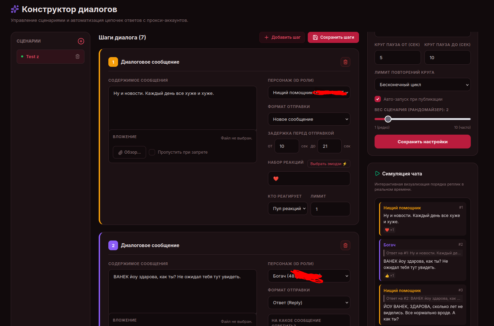
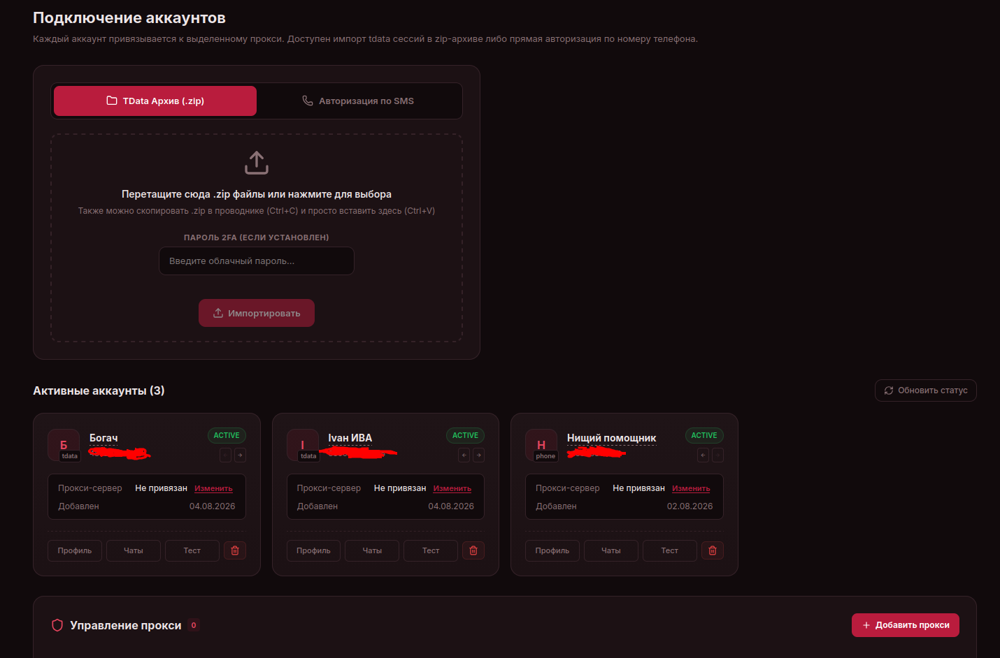
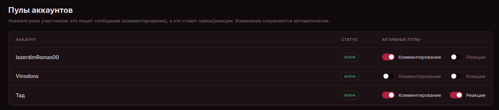
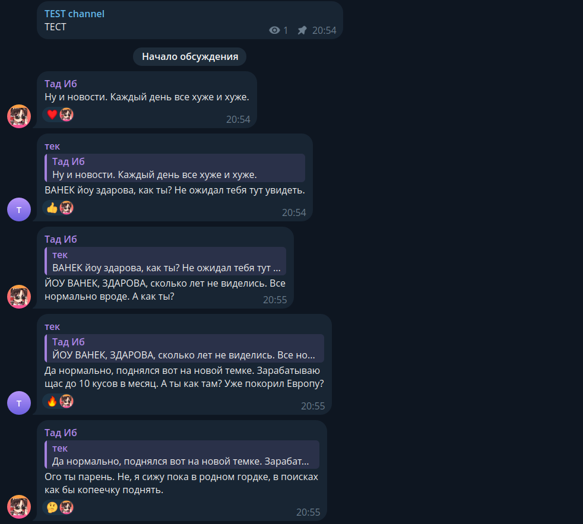

# TgActor — Инструмент для симуляции реалистичных диалогов и тестирования сценариев общения в Telegram

<p align="center">
  
  
  
  
  
  
</p>

> **TgActor** — это открытый программный комплекс для симуляции реалистичных диалогов, нагрузочного тестирования и эмуляции сценариев общения в Telegram. Система позволяет группе независимых Telegram-аккаунтов разыгрывать сценарии коммуникации (ответы на реплики, медиавложения, эмодзи-реакции и задержки) под публикациями в каналах или внутри групповых чатов.

---

## Оглавление

1. [О проекте](#о-проекте)
2. [Сценарии применения (Use Cases)](#сценарии-применения-use-cases)
3. [Ключевые возможности](#ключевые-возможности)
4. [Галерея интерфейса](#галерея-интерфейса)
5. [Архитектура и техническая документация](#архитектура-и-техническая-документация)
6. [Генерация секретного ключа (Python)](#генерация-секретного-ключа-python)
7. [Установка и запуск на Windows](#установка-и-запуск-на-windows)
8. [Установка и запуск на Linux / VPS](#установка-и-запуск-на-linux--vps)
9. [Варианты подключения домена и HTTPS](#варианты-подключения-домена-и-https)
10. [Конфигурация переменные окружения](#конфигурация-переменные-окружения)
11. [Лицензия и отказ от ответственности](#лицензия-и-отказ-от-ответственности)

---

## О проекте

В отличие от традиционного софта для рассылок, **TgActor** сфокусирован на создании **живой и естественной коммуникации**. Несколько подключенных Telegram-аккаунтов выступают в роли персонажей по вашему сценарию:
- Вы заранее определяете текст реплик, порядок ответов (кто на какое сообщение отвечает) и случайные интервалы задержек перед отправкой.
- Аккаунты автоматически выстраивают древовидную хронологическую цепочку комментариев.
- Для каждого сообщения можно настроить автоматическую постановку эмодзи-реакций от других участников пула.

---

## Сценарии применения (Use Cases)

- **Тестирование систем модерации и спам-фильтров**: Валидация автоматических правил модерации чатов и алгоритмов выявления аномальной активности в реальных условиях.
- **Обучение AI-моделей и сбор датасетов**: Генерация и подготовка структурированных диалоговых данных для последующего обучения LLM и чат-ботов.
- **Исследование поведения пользователей**: Моделирование реакций аудитории на различные сценарии подачи информации и структуры обсуждений.
- **Нагрузочное тестирование чат-платформ**: Проверка устойчивости ботов, шлюзов и обработчиков сообщений при одновременно поступающих диалоговых потоках.
- **Создание демо-стендов и прототипов**: Демонстрация продуктовых концепций на реалистичных эмулированных диалогах.

---

## Ключевые возможности

- **Визуальный конструктор сценариев**: Создание цепочек сообщений любой длины, привязка персонажей, загрузка медиафайлов, настройка диапазона пауз (в секундах) и выбор набора эмодзи.
- **Интерактивный симулятор чата**: Живой предпросмотр порядка ответов и визуальная эмуляция ветки комментариев прямо в браузере до запуска в Telegram.
- **Автоматический мониторинг каналов**: Фоновый слушатель публикаций. При выходе нового поста система автоматически определяет привязанную группу обсуждения, подбирает сценарий с учётом антиповторов и запускает диалог.
- **Плавный фоновый вход (Staggered Join)**: Безопасное вступление аккаунтов в обсуждения не одновременно, а с настраиваемыми интервалами (например, через 20, 45, 75 секунд) для предотвращения банов Telegram.
- **Управление пулами аккаунтов**: Гибкое разделение ролей — комментирующие аккаунты (ведение беседы) и аккаунты реакций (постановка эмодзи-лайков).
- **Централизованный инбокс (Unified Inbox)**: Чтение и отправка личных сообщений со всех подключенных профилей в одном окне с мгновенным обновлением по WebSockets.
- **Поддержка любых форматов импорта**: Быстрый импорт сессий `tdata` (Zip-архивы с автоматической поддержкой 2FA) или прямая авторизация по номеру телефона через SMS.
- **Изоляция через прокси**: Привязка индивидуального SOCKS5 или HTTP прокси-сервера к каждому аккаунту с проверкой статуса соединения в один клик.

---

## Галерея интерфейса

### 1. Конструктор сценариев и симулятор чата


### 2. Подключение аккаунтов и настройка пулов
| Карточки профилей и импорт | Настройка пулов (Комментирование / Реакции) |
| :---: | :---: |
|  |  |

### 3. Результат выполнения в Telegram


## Архитектура и техническая документация

Подробная информация об архитектуре системы, диаграмма взаимодействия сервисов (Mermaid), описание ключевых инженерных решений (Technical Highlights), стек технологий и меры защиты данных вынесены в отдельный документ:

[Документация по архитектуре и технические решения (docs/ARCHITECTURE.md)](docs/ARCHITECTURE.md)

В документе представлены:
- **Диаграмма взаимодействия компонентов**: Потоки данных между Telegram, воркерами, PostgreSQL/SQLite, Redis Pub/Sub и React SPA.
- **Инженерные решения (Technical Highlights)**: Алгоритмы Smart Account Fallback, Staggered Join, разрешение тредов обсуждений Telegram и динамический патчинг MTProto.
- **Стек технологий и безопасность**: Использование FastAPI, Hydrogram, SQLAlchemy 2.0, Opentele2 и Fernet-шифрование сессий.
- **Architecture Decision Records (ADR)**: Зафиксированные архитектурные решения проекта.

---

## Генерация секретного ключа (Python)

Для работы приложения и шифрования сессий Telegram необходим уникальный секретный ключ `SECRET_KEY` в файле `.env`.

Вы можете мгновенно сгенерировать стойкий криптографический ключ с помощью встроенного модуля `secrets` в Python. Выполните команду в вашем терминале (PowerShell, CMD, Git Bash или Linux terminal):

```bash
python -c "import secrets; print(secrets.token_urlsafe(32))"
```

Скопируйте вывод этой команды и вставьте в ваш файл `.env` в строку `SECRET_KEY=...`.

---

## Установка и запуск на Windows

1. **Установите Docker Desktop**:
   Скачайте и установите [Docker Desktop для Windows](https://www.docker.com/products/docker-desktop/) (убедитесь, что включен компонент WSL 2).

2. **Откройте PowerShell или Git Bash** и клонируйте репозиторий:
   ```powershell
   git clone https://github.com/ivanchik-byte/TgCast.git
   cd TgCast
   ```

3. **Создайте файл конфигурации `.env`**:
   В PowerShell скопируйте шаблон:
   ```powershell
   Copy-Item .env.example .env
   ```
   Или в Git Bash / Command Prompt:
   ```cmd
   copy .env.example .env
   ```

4. **Задайте ключи и пароли в файле `.env`**:
   - Откройте файл `.env` в Блокноте или редакторе (например, VS Code).
   - Сгенерируйте секретный ключ командой:
     ```powershell
     python -c "import secrets; print(secrets.token_urlsafe(32))"
     ```
   - Впишите сгенерированный ключ в переменную `SECRET_KEY`.
   - Укажите ваш пароль в `ADMIN_PASSWORD`.

5. **Запустите приложение**:
   ```powershell
   docker compose up -d --build
   ```

6. **Откройте веб-панель**:
   Перейдите в браузере по адресу: `http://localhost:8000`

---

## Установка и запуск на Linux / VPS

1. **Клонируйте репозиторий**:
   ```bash
   git clone https://github.com/ivanchik-byte/TgCast.git
   cd TgCast
   ```

2. **Создайте файл конфигурации `.env`**:
   ```bash
   cp .env.example .env
   ```

3. **Сгенерируйте секретный ключ**:
   ```bash
   python3 -c "import secrets; print(secrets.token_urlsafe(32))"
   ```
   Впишите ключ в `SECRET_KEY` и установите пароль в `ADMIN_PASSWORD` внутри `.env`.

4. **Запустите сервисы через Docker Compose**:
   ```bash
   docker compose up -d --build
   ```

5. **Откройте панель в браузере**:
   Перейдите по адресу: `http://IP_ВАШЕГО_СЕРВЕРА:8000`.

---

## Варианты подключения домена и HTTPS

Вы можете подключить собственный домен (`https://yourdomain.com`) для доступа к веб-панели одним из следующих способов:

### Вариант 1. Автоматический HTTPS через Caddy (Встроенный способ)
1. Укажите имя вашего домена в файле `.env`:
   ```env
   DOMAIN=tgcast.yourdomain.com
   ```
2. Убедитесь, что A-запись вашего домена указывает на IP-адрес вашего сервера.
3. Запустите проект (`docker compose up -d --build`). Встроенный контейнер Caddy автоматически получит бесплатный SSL-сертификат от Let's Encrypt и перенаправит трафик на HTTPS.

### Вариант 2. Через сервисы проксирования (Cloudflare)
1. Добавьте ваш домен в бесплатный тариф **Cloudflare** и направьте A-запись на IP-адрес сервера.
2. Включите режим SSL (Flexible/Full).
3. Cloudflare автоматически выдаст HTTPS-сертификат, дополнительно защитит панель от DDoS-атак и откроет сайт по `https://yourdomain.com`.

### Вариант 3. Через системный Nginx + Certbot на сервере
1. Скопируйте готовый шаблон конфигурации `nginx.conf.example` в директорию Nginx:
   ```bash
   sudo cp nginx.conf.example /etc/nginx/sites-available/tgcast
   ```
2. Выпустите бесплатный сертификат командой:
   ```bash
   sudo certbot --nginx -d tgcast.yourdomain.com
   ```

### Вариант 4. Стандартный запуск без домена (HTTP / IP-адрес)
Если вам не требуется домен, вы можете зайти напрямую в браузер по адресу: `http://localhost:8000` или `http://IP_СЕРВЕРА:8000`.

---

## Конфигурация переменные окружения

Ниже приведены переменные окружения из файла `.env`:

| Переменная | Описание | Значение по умолчанию |
| :--- | :--- | :--- |
| `ADMIN_PASSWORD` | Пароль для входа в панель управления | `change_this_secure_password` |
| `SECRET_KEY` | Секретный ключ для Fernet-шифрования сессий | `generate_random_secret_key` |
| `DATABASE_URL` | Подключение к PostgreSQL или SQLite | `postgresql+asyncpg://tgcast:tgcast_pass@db:5432/tgcast_db` |
| `REDIS_URL` | Подключение к брокеру сообщений Redis Pub/Sub | `redis://redis:6379/0` |
| `DOMAIN` | Ваш домен для авто-выпуска SSL в Caddy | `localhost` |
| `TELEGRAM_API_ID` | Telegram API ID (с my.telegram.org) | `6` |
| `TELEGRAM_API_HASH` | Telegram API Hash | `eb066357b5211d4e73b7b28e65d16d7f` |

---

## Лицензия и отказ от ответственности

Проект распространяется под лицензией **MIT License**. Полный текст доступен в файле [LICENSE](LICENSE).

**Дисклеймер**: TgActor разработан исключительно в исследовательских целях и для демонстрации в портфолио. Автор не несет ответственности за любое использование данного программного обеспечения, нарушающее Условия использования Telegram (Telegram Terms of Service).
