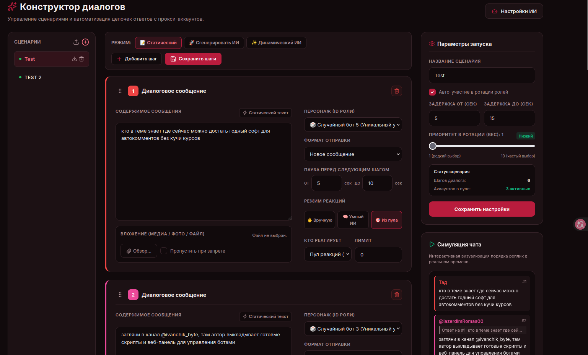
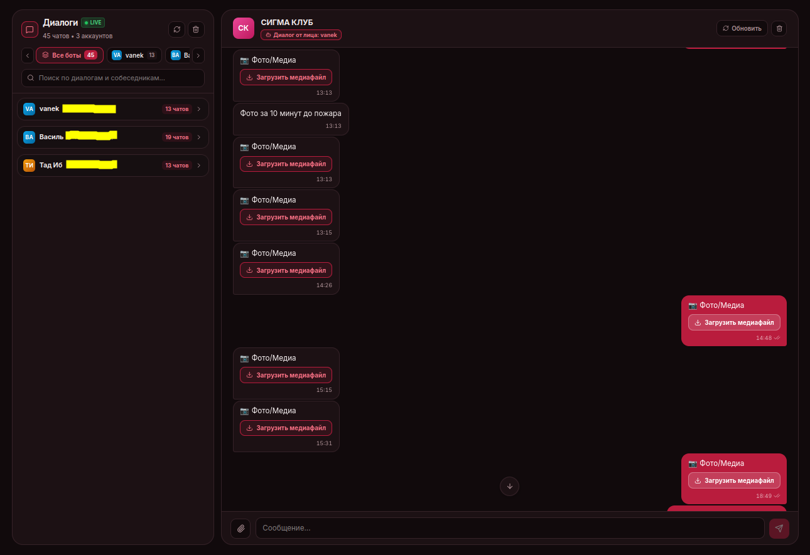
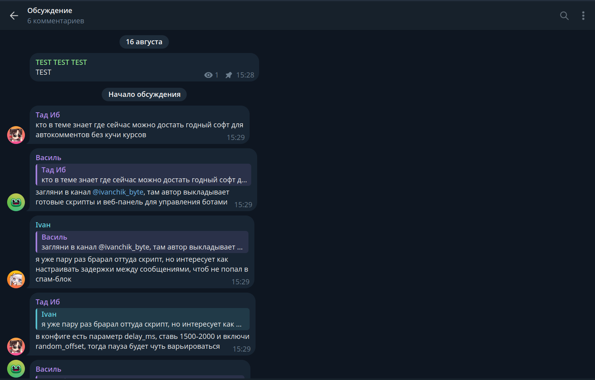

# TgActor (TgCast) — Программа для управления Telegram-аккаунтами и создания живых диалогов

<p align="center">
  
  
  
  
  
  
  
</p>

<p align="center">
  <a href="https://t.me/ivanchik_byte"></a>
  <a href="https://t.me/ivanchikbyte"></a>
</p>

TgActor — это программа с веб-интерфейсом для управления сеткой Telegram-аккаунтов. Она позволяет автоматически разыгрывать естественные диалоги под постами в каналах, ставить реакции-лайки, перехватывать новые публикации и отвечать на входящие сообщения со всех аккаунтов в одном окне.

- Telegram-канал разработчика: [https://t.me/ivanchik_byte](https://t.me/ivanchik_byte) (новости, шаблоны сценариев, полезные скрипты).
- Личные сообщения разработчика: [https://t.me/ivanchikbyte](https://t.me/ivanchikbyte) (вопросы, предложения, связь).

---

## Оглавление

1. [Что умеет программа](#что-умеет-программа)
2. [Скриншоты интерфейса](#скриншоты-интерфейса)
3. [Как это работает](#как-это-работает)
4. [Установка и запуск на Linux / VPS](#установка-и-запуск-на-linux--vps)
5. [Установка и запуск на Windows](#установка-и-запуск-на-windows)
6. [Генерация секретного ключа (SECRET_KEY)](#генерация-секретного-ключа-secret_key)
7. [Настройка файла .env](#настройка-файла-env)
8. [Устранение частых ошибок](#устранение-частых-ошибок)
9. [Контакты и лицензия](#контакты-и-лицензия)

---

## Что умеет программа

- Конструктор диалогов: создание цепочек сообщений любой длины с ответами ботов друг на друга, паузами и прикреплением файлов.
- Генерация текста через нейросеть (ИИ):
  - Создание готового сценария по вашему описанию в 1 клик.
  - Динамический режим: нейросеть сама формулирует уникальный текст ответа прямо во время комментирования поста.
- Мониторинг каналов (Радар): программа следит за каналами и, как только выходит новый пост, автоматически отправляет ботов комментировать его.
- Плавный вход ботов: боты заходят в чаты по очереди с паузами (например, раз в 30-60 секунд), чтобы избежать спам-блокировок Telegram.
- Разделение аккаунтов на пулы: одни аккаунты пишут текст, другие ставят эмодзи-реакции.
- Единый чат (Инбокс): чтение и отправка личных сообщений со всех подключенных аккаунтов в одной вкладке.
- Удобный импорт: добавление аккаунтов через архивы TData (с поддержкой 2FA) или по SMS-коду.
- Поддержка прокси: к каждому аккаунту можно привязать отдельный SOCKS5 или HTTP прокси.

---

## Скриншоты интерфейса

### 1. Конструктор сценариев и предпросмотр чата
Удобный визуальный редактор диалогов с живой симуляцией порядка ответов.



---

### 2. Централизованный инбокс (Входящие сообщения)
Чтение и отправка личных сообщений со всех подключенных аккаунтов в едином окне.



---

### 3. Управление аккаунтами и пулами
Импорт аккаунтов, привязка прокси и настройка ролей ботов.


---

### 4. Пример диалога в Telegram
Результат работы ботов: связная ветка комментариев с ответами участников друг другу.



Полная галерея всех экранов программы доступна в файле [docs/SCREENSHOTS.md](docs/SCREENSHOTS.md).

---

## Как это работает

1. Вы загружаете свои Telegram-аккаунты через TData или SMS.
2. Создаете сценарий вручную или генерируете его через встроенный ИИ (поддерживаются NVIDIA NIM, DeepSeek, OpenAI).
3. Добавляете нужные каналы во вкладку «Мониторинг».
4. Программа автоматически находит группу обсуждений под каналом, безопасно добавляет туда ботов и запускает обсуждение по вашему сценарию.

---

## Установка и запуск на Linux / VPS

Самый простой способ запуска — через Docker.

1. Склонируйте репозиторий:
   ```bash
   git clone https://github.com/ivanchik-byte/TgCast.git
   cd TgCast
   ```

2. Скопируйте файл настроек:
   ```bash
   cp .env.example .env
   ```

3. Сгенерируйте секретный ключ:
   ```bash
   python3 -c "import secrets; print(secrets.token_urlsafe(32))"
   ```
   Вставьте полученный ключ в строку `SECRET_KEY=` внутри файла `.env`, а также укажите свой пароль в `ADMIN_PASSWORD=`.

4. Запустите программу:
   ```bash
   docker compose up -d --build
   ```

5. Откройте панель в браузере: `http://IP_ВАШЕГО_СЕРВЕРА:8000`.

---

## Установка и запуск на Windows

1. Установите программу [Docker Desktop](https://www.docker.com/products/docker-desktop/).
2. Откройте PowerShell или командную строку:
   ```powershell
   git clone https://github.com/ivanchik-byte/TgCast.git
   cd TgCast
   Copy-Item .env.example .env
   ```
3. Сгенерируйте секретный ключ:
   ```powershell
   python -c "import secrets; print(secrets.token_urlsafe(32))"
   ```
   Откройте файл `.env` в Блокноте, вставьте сгенерированный ключ в `SECRET_KEY` и задайте пароль в `ADMIN_PASSWORD`.
4. Запустите контейнеры:
   ```powershell
   docker compose up -d --build
   ```
5. Откройте в браузере: `http://localhost:8000`.

---

## Генерация секретного ключа (SECRET_KEY)

Ключ необходим для шифрования Telegram-сессий в базе данных. Выполните команду в терминале:

```bash
python3 -c "import secrets; print(secrets.token_urlsafe(32))"
```

Скопируйте полученную строку и вставьте в `.env` в поле `SECRET_KEY=`.

---

## Настройка файла .env

| Параметр | Описание | Значение по умолчанию |
| :--- | :--- | :--- |
| `ADMIN_PASSWORD` | Пароль для входа в веб-панель | `admin` |
| `SECRET_KEY` | Секретный ключ шифрования сессий | Сгенерированный ключ |
| `DATABASE_URL` | Подключение к базе данных PostgreSQL | `postgresql+asyncpg://tgactor:tgactor_password@db:5432/tgactor_db` |
| `REDIS_URL` | Подключение к брокеру Redis | `redis://redis:6379/0` |
| `ENABLE_CHANNEL_MONITOR` | Включить фоновый мониторинг каналов | `True` |
| `ENABLE_INBOX_LISTENER` | Включить прием личных сообщений | `True` |

---

## Устранение частых ошибок

- Не заходит в панель (Unauthorized): проверьте пароль в файле `.env` и очистите куки сайта в браузере.
- Боты не комментируют: проверьте, что в конструкторе сценариев есть хотя бы один активный сценарий с заполненными шагами, и что у канала открыты комментарии.
- ИИ долго думает: в окне «Настройки ИИ» переключите модель на быструю (например, `meta/llama-3.3-70b-instruct` или `deepseek-chat`).

Полезные команды для управления:
```bash
# Посмотреть логи бэкенда
docker compose logs -f backend

# Перезапустить бэкенд
docker compose restart backend

# Остановить программу
docker compose down
```

---

## Контакты и лицензия

- Telegram-канал разработчика: [https://t.me/ivanchik_byte](https://t.me/ivanchik_byte)
- Личные сообщения: [https://t.me/ivanchikbyte](https://t.me/ivanchikbyte)
- Лицензия: [MIT License](LICENSE)

Отказ от ответственности: программа разработана для тестирования, исследований и демонстрационных целей. Используйте софт с соблюдением правил платформы Telegram.
