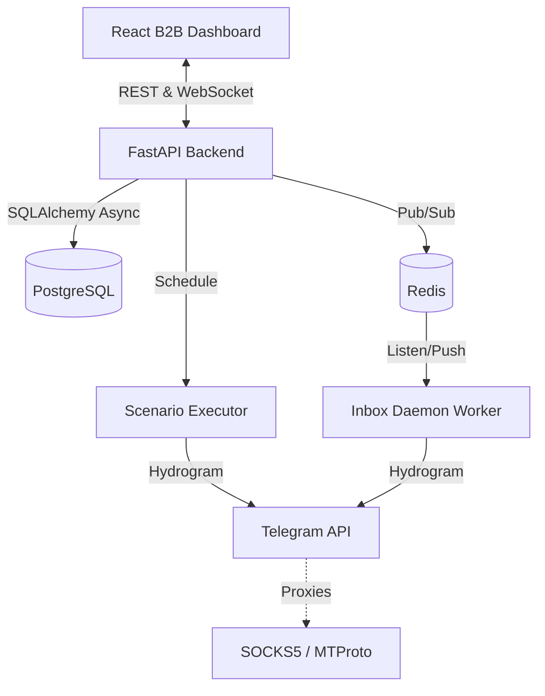

# TgCast


**TgCast** — это автономная система эмуляции социальной активности (бот-ферма) по детерминированным сценариям в Telegram. 
Несколько аккаунтов по заранее заданным ролям разыгрывают связную беседу (реплики, ответы друг другу, медиа, реакции) под постом или внутри чата. 
Всё происходит по вашему сценарию, без расходов на ИИ-ключи (LLM). Со стороны это выглядит как обычное, живое обсуждение.

## System Overview (Архитектура)

Проект использует современную архитектуру с упором на отказоустойчивость и единый B2B UI управления. В режиме Single-Container SPA фронтенд раздается самим FastAPI.



## Ключевые возможности

- **Scenario Builder**: Карточный конструктор веток (цепочки от 1 до N реплик с `reply_to`). Разделение на пулы комментаторов и реакторов.
- **Sticky Proxy (1:1)**: Жесткая привязка аккаунта к IP-адресу для обхода антифрод-систем.
- **Авто-конвертация TData**: Загрузка `.zip` архивов TData и конвертация в зашифрованные `.session` прямо в браузере.
- **Unified Inbox (WebSocket)**: Реалтайм мессенджер для управления личными сообщениями всей фермы из одного окна.
- **Anti-Spam Protection**: Защита от FloodWait, умные паузы, имитация набора текста (`typing action`).
- **3 B2B Темы Оформления**: Строгий дизайн в стилистике Stripe (Dark Crimson, Dark Charcoal, Clean Light).

## Быстрый старт (Quick Start)

Запуск TgCast оптимизирован под `docker-compose`. Вся система (React SPA + FastAPI + PostgreSQL + Redis) поднимается одной командой.

1. **Клонируйте репозиторий:**
   ```bash
   git clone https://github.com/ivanchik-byte/TgCast.git
   cd TgCast
   ```

2. **Настройте переменные окружения:**
   ```bash
   cp .env.example .env
   ```
   *Обязательно сгенерируйте `ENCRYPTION_KEY` для `.env` с помощью Python:*
   ```python
   from cryptography.fernet import Fernet
   print(Fernet.generate_key().decode())
   ```

3. **Запустите контейнеры:**
   ```bash
   docker compose up -d --build
   ```

4. **Откройте панель управления:**
   Перейдите в браузере по адресу: [http://localhost:8000](http://localhost:8000)
   Пароль по умолчанию: `admin` (настраивается в `.env`).

## ⚠️ Disclaimer (Отказ от ответственности)

Данное программное обеспечение создано исключительно в образовательных целях.
**КРИТИЧЕСКИЙ РИСК:** Использование системы без настроенных прокси-серверов приведет к прямому подключению через IP вашего сервера. Существует высокая вероятность мгновенного бана всей сетки аккаунтов антифрод-системой Telegram. Автор не несет ответственности за заблокированные аккаунты, финансовые потери или любой иной ущерб, вызванный использованием данного ПО. Соблюдайте ToS Telegram.
