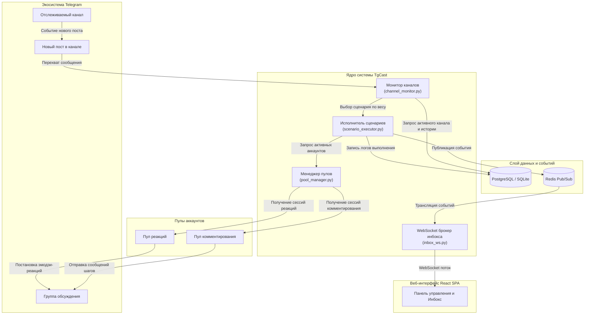

# Архитектурная документация системы TgCast (Architecture & ADR)

В данном документе описана архитектура системы TgCast, взаимодействие её компонентов, потоки данных и ключевые архитектурные решения (Architecture Decision Records).

---

## 1. Схема взаимодействия компонентов

Ниже представлена диаграмма потоков данных и связей между сервисами: от отслеживания публикаций до исполнения сценариев и работы пулов аккаунтов.

---

## 2. Поток обработки событий (Event Pipeline)

1. **Мониторинг канала (Channel Monitor)**:
   - Слушатель на базе Hydrogram подписан на обновление отслеживаемых Telegram-каналов.
   - При появлении нового поста происходит валидация канала в базе данных и вычисление случайной задержки (`min_delay_seconds` ... `max_delay_seconds`).

2. **Подбор сценария и разрешения обсуждения (Discussion Resolution)**:
   - Модуль мониторинга выбирает сценарий с учетом весов (`Scenario.weight`) и алгоритма исключения повторов (`no_repeat_scenarios`).
   - Разрешается целевая группа обсуждений (`get_discussion_message`), чтобы комментарии отправлялись именно в соответствующую ветку под постом.

3. **Распределение аккаунтов из пулов (Account Pools Allocation)**:
   - Исполнитель запросов (`scenario_executor.py`) запрашивает активные аккаунты из пула комментирования и пула реакций.
   - Если указанный в шаге аккаунт недоступен или заблокирован, включается алгоритм **Smart Account Fallback**, автоматически передающий роль другому свободному аккаунту из пула.

4. **Исполнение и журналирование**:
   - Аккаунты последовательно отправляют реплики, загружают медиавложения и выставляют эмодзи-реакции.
   - Статусы шагов записываются в таблицу `task_logs` в БД и публикуются в канал Redis Pub/Sub `inbox_events`.

---

## 3. Записи архитектурных решений (Architecture Decision Records — ADR)

### ADR 001: Использование FastAPI + Hydrogram (Async MTProto)
- **Контекст**: Для управления множеством одновременно работающих сессий Telegram требовался высокопроизводительный асинхронный фреймворк.
- **Решение**: Выбран стек Python 3.10+ с FastAPI для REST API / WebSockets и Hydrogram для работы с Telegram MTProto API в едином событийно-ориентированном цикле (Event Loop).
- **Последствия**: Высокая пропускная способность при минимальном потреблении оперативной памяти по сравнению с синхронными потоками.

### ADR 002: Алгоритм отложенного входа (Staggered Join Strategy)
- **Контекст**: Одновременный вступление нескольких аккаунтов в новую группу обсуждения приводит к срабатыванию спам-фильтров Telegram.
- **Решение**: Внедрен механизм фонового вступления (Staggered Join). При старте мониторинга аккаунты вступают в связанные группы не одновременно, а с настраиваемыми задержками (20с, 45с, 75с...).
- **Последствия**: Защита сессий от блокировок и выявления автоматизированных паттернов.

### ADR 003: Redis Pub/Sub и WebSockets для Unified Inbox
- **Контекст**: Требовалась мгновенная доставка входящих личных сообщений со всех аккаунтов в единый интерфейс оператора без постоянных опрашивающих HTTP-запросов (polling).
- **Решение**: Релизована шина сообщений Redis Pub/Sub. Слушатели сессий публикуют входящие события в Redis, а модуль `inbox_ws.py` транслирует их по WebSocket в клиентский интерфейс React.
- **Последствия**: Мгновенный отклик интерфейса, снижение нагрузки на БД.

### ADR 004: Симметричное шифрование Fernet (AES-128) для файлов сессий
- **Контекст**: Данные авторизации Telegram-аккаунтов в БД не должны храниться в открытом виде на случай компрометации снимка базы данных.
- **Решение**: Применена Fernet-схема шифрования (AES-128 в режиме CBC с подписью HMAC-SHA256). Сессии шифруются на лету при сохранении в БД и расшифровываются только в момент создания клиентов.
- **Последствия**: Выполнение требований по безопасности при хранении чувствительных учетных данных.
