# Галерея интерфейса TgActor

Полный каталог скриншотов веб-панели управления TgActor.

---

### 1. Конструктор сценариев и симуляция диалогов
Визуальный редактор пошаговых сценариев общения с поддержкой древовидных ответов, задержек и симуляции в реальном времени.

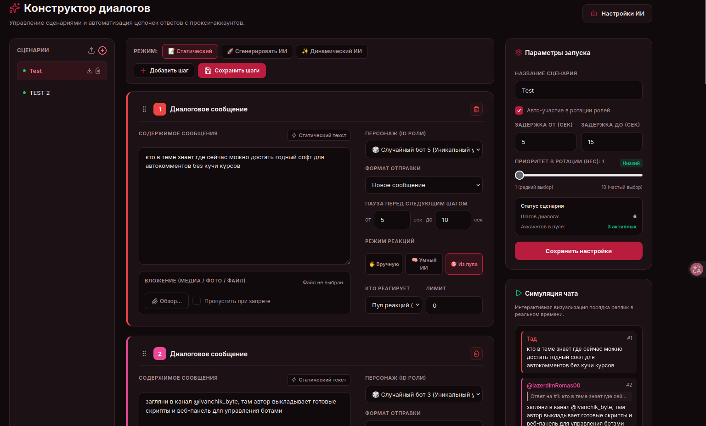

---

### 2. Мастер Динамических ИИ-Сценариев
Генерация живых реплик нейросетью во время исполнения сценария на основе темы поста.

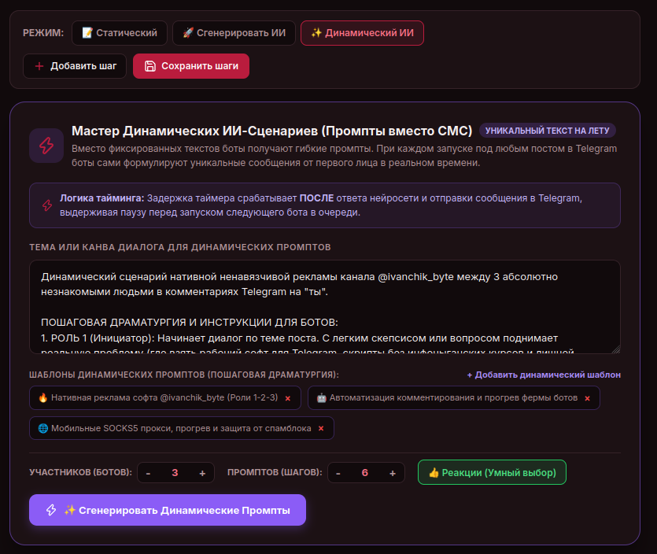

---

### 3. Мастер Статической ИИ-Генерации
Создание готовых диалоговых сценариев по текстовому описанию и встроенным шаблонам.

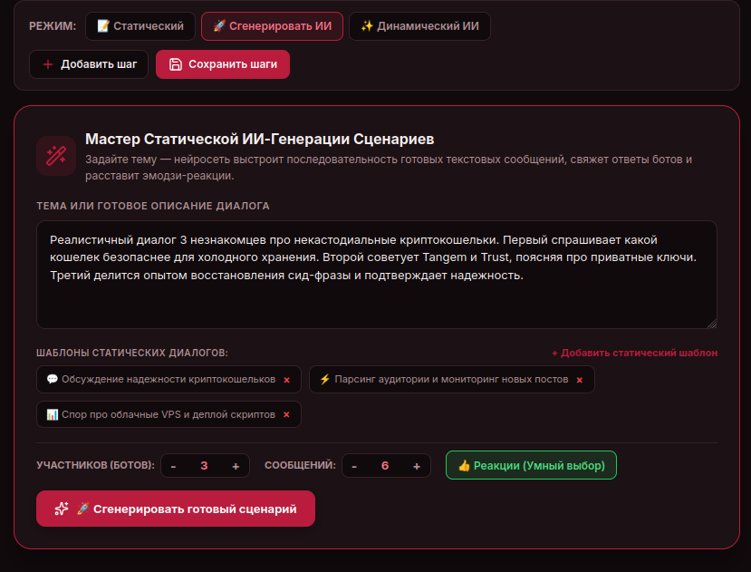

---

### 4. Интерактивная симуляция диалога
Визуальный предпросмотр порядка реплик, ответов и реакций прямо в веб-интерфейсе перед отправкой в Telegram.

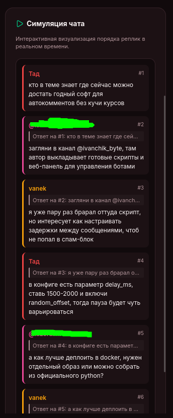

---

### 5. Флот каналов на радаре
Список отслеживаемых каналов с индивидуальными настройками задержек и статусом активности.

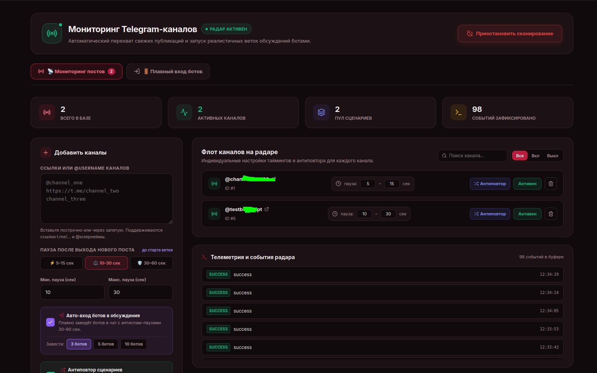

---

### 6. Мастер плавного входа ботов (Staggered Join)
Очередь безопасного пошагового вступления ботов в группы и чаты обсуждений с антиспам-паузами.

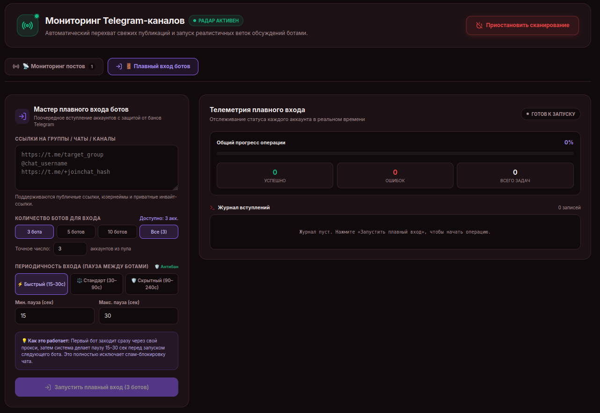

---

### 7. Телеметрия плавного входа в реальном времени
Отслеживание процесса поочередного входа аккаунтов с индикатором прогресса и журналом.

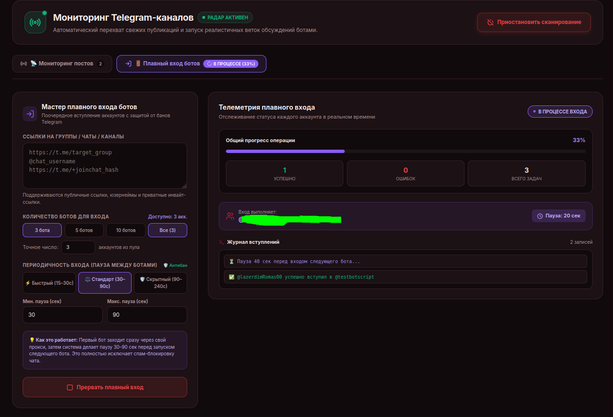

---

### 8. Успешное завершение операции входа
Фиксация 100% готовности ботов к работе в целевой группе.

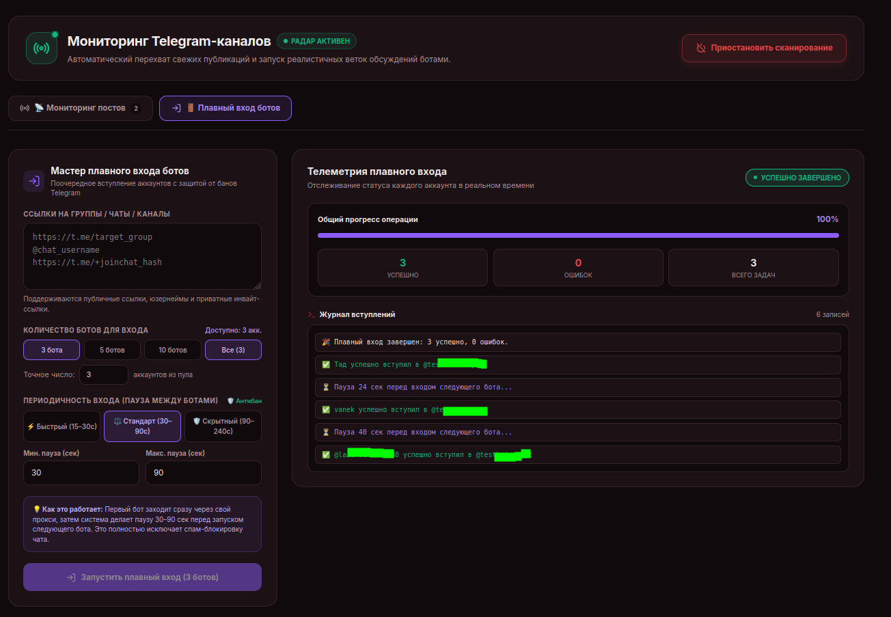

---

### 9. Управление аккаунтами и импорт TData
Список подключенных Telegram-аккаунтов, привязка прокси, проверка работоспособности и drag-and-drop импорт сессий.

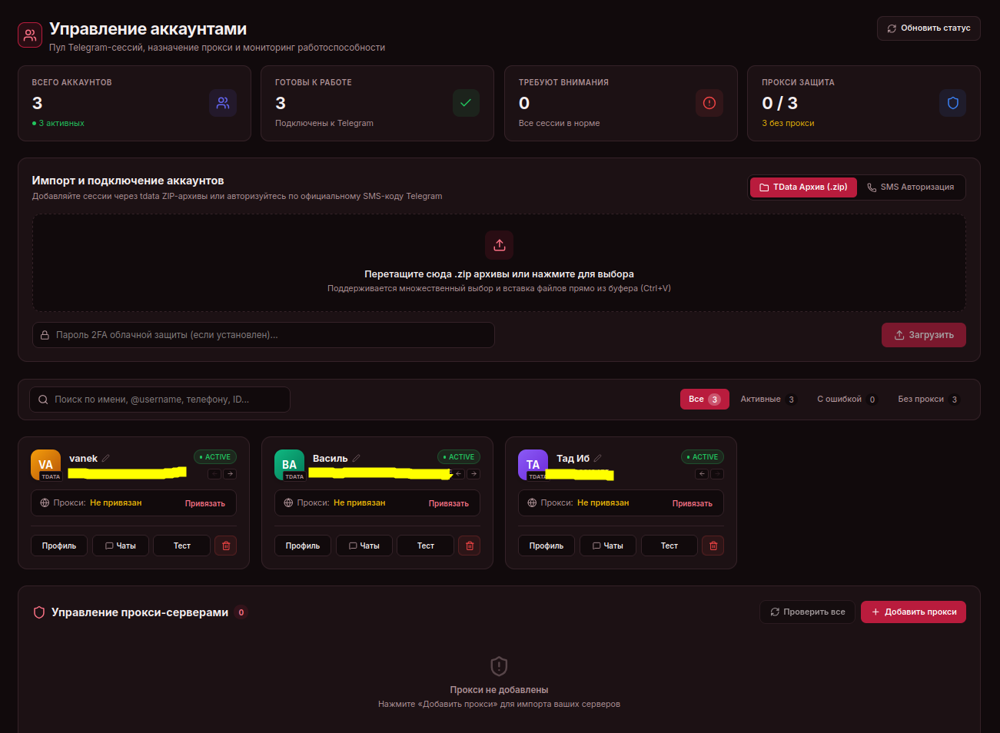

---

### 10. Пулы аккаунтов и оркестрация ролей
Разделение сетки на комментирующие аккаунты, аккаунты реакций и универсальные профили.

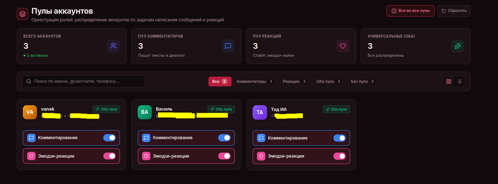

---

### 11. Централизованный инбокс (Unified Inbox)
Чтение и отправка личных сообщений со всех подключенных аккаунтов в едином окне с фильтрацией ботов.

---

### 12. Журнал активности аккаунтов (Action Logs)
Детализированный аудит действий в реальном времени (Хронология, Консоль, Аналитика, инспектор JSON).

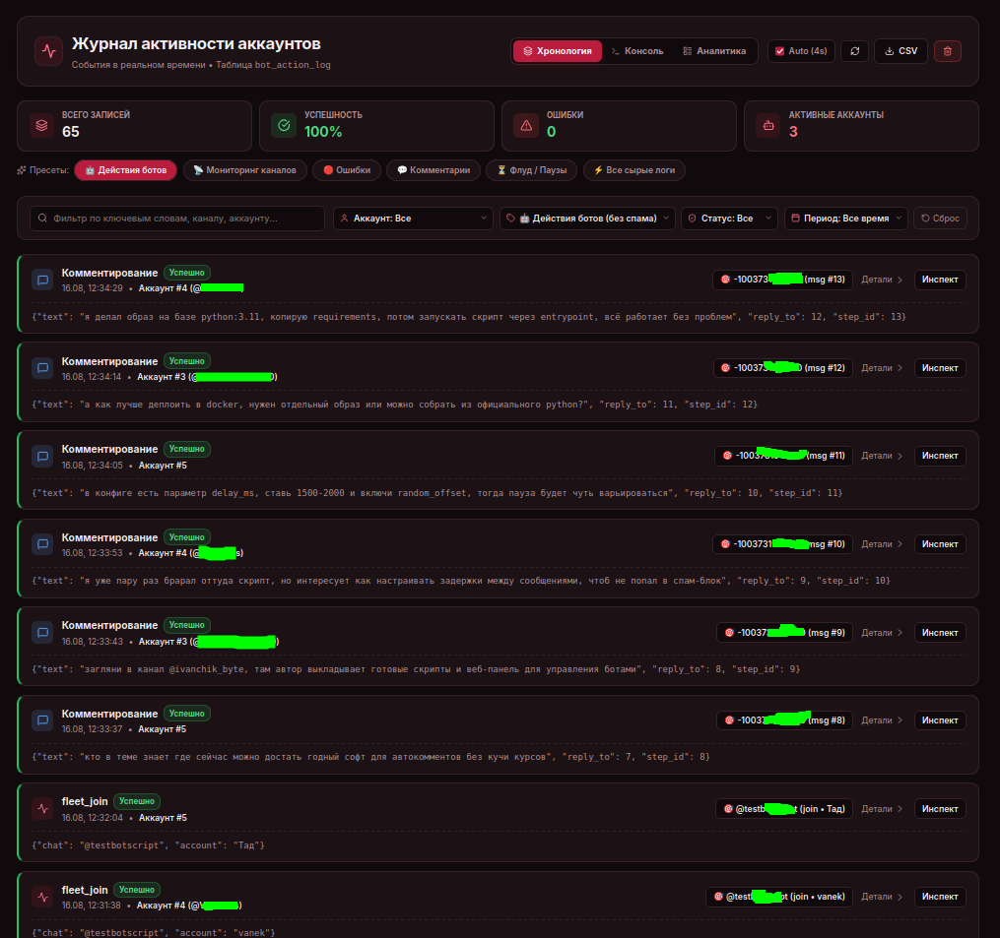

---

### 13. Результат живой дискуссии в Telegram
Пример реальной ветки комментариев под публикацией в Telegram, разыгранной ботами TgActor.

